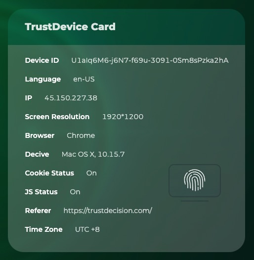

<p align="center">
  <a href="https://www.trustdecision.com/deviceFingerprint" >
    <picture>
      <source media="(prefers-color-scheme: dark)" srcset="static/image/logo_dark.png" />
      <source media="(prefers-color-scheme: light)" srcset="static/image/logo_light.png" />
          </picture>
  </a>
</p>

## TrustDevice-JS

<p align="center">
  <a href="https://www.npmjs.com/package/@trustdevicejs/trustdevice-js">
    
  </a>
  <a href="https://www.npmjs.com/package/@trustdevicejs/trustdevice-js">
    
  </a>
  <a href="https://www.jsdelivr.com/package/npm/@trustdevicejs/trustdevice-js">
    
  </a>
</p>
A lightweight library for determining device uniqueness and risk identification.

Create a device identifier based on basic device information.

Will remain the same after uninstalling and reinstalling or clearing browser data.

[Open Source Demo](https://statictest.tongdun.net/trustdevice/index.html).

### Browser support

- Internet Explorer 9+
- Edge 12+
- Chrome 33+
- Firefox 29+
- Desktop Safari 7.1+
- Mobile Safari 8+
- Android Browser 4.4+

## Integration Description

```html
<script>
    (function () {
      window._fmOpt = {
        success: function (result) {
          console.log('deviceId: ', result.deviceId)
        }
      }
      var fm = document.createElement('script');
      fm.type = 'text/javascript';
      fm.async = true;
      fm.src =
      './dist/fm.js?t='
      + (new Date().getTime()/3600000).toFixed(0);
      var s = document.getElementsByTagName('script')[0];
      s.parentNode.insertBefore(fm, s);
    })();
  </script>
```
## Open Source Features

+ Basic device ID, consistent when uninstalling applications and reinstalling.
+ Basic equipment information, which can be used for simple data analysis.
+ Basic risk identification ability

| RiskLabel      |       Risk Description |
| --------- | --------------------------- |
| disabledCookie   |    Cookies are set to disable.      |
| debugger   |  The attacker or developer opens the browser developer tool for debugging.         |

## Open Source VS Pro
| Ability | Open Source |  Pro  |
| :-------: | :-------: | :-------------------------: |
| 100%open source | yes | no |
| Device ID | Basic | Extremely stable |
| Device Risk Label | Basic | Extremely rich |
| Device Details | Basic  | Extremely rich |
| IP Location | -  | √ |
| Device Risk Score | -  | √ |
| Environment Risk Evaluation | -  | √ |
| Fraud Tools Detection | -  | √ |
| Behavioral Activity Capturing | -  | √ |

## Pro Introduction

TrustDecision TrustDevice has the leading device fingerprint technology, which has been integrated by more than 10000 global leading brands, protecting the entire customer journey.

<p align="left">
  <a href="https://github.com/trustdecision/trustdevice-js">
    
  </a>
</p>

**There are 6 leading core features about TrustDevice Pro:**

### 1. Wide Coverage
Comprehensive coverage of Android, iOS, Web, H5, applets and other device types.

### 2. Stable and Reliable
TrustDevice served more than 10,000 clients, 200 million+ daily active users , and 6 billion+ devices , with excellent product functions and stability.
The fingerprint accuracy of different terminal devices exceeded 99.9%, and the output of risk labels exceeded 70 items.

### 3. Unparalleled Safety
TrustDevice's code virtualization & obfuscation technology make the malware fraudsters suffer from painful cost and imprecision when performing reverse-engineering.

### 4. Core Intellectual Property
Fully independent intellectual property rights, with a number of patented technology.

### 5. Security Compliance
TrustDevice is committed to the highest standards in security and compliance to keep your data safe.
GDPR/CCA/PCI DSS/ISO 27701/ISO 9001 Compliant.

### 6. Easy to Deploy
SaaS（Software as a Service）deployment supported, reducing massively your integration cost and enabling rapid access to device fingerprint service.


# Where to get support
We are happy to provide technical support for our open-source trustdevice-js library. We recommend using GitHub Issues to submit bugs or Discussions to ask questions. Using issues and discussions publicly will help the open-source community and other users with similar issues.

In addition, any idea or interest in using TrustDevice Pro can be found on the official website（ [https://www.trustdecision.com/deviceFingerprint](https://www.trustdecision.com/deviceFingerprint) ）, registered account, free trial; Or via email（ TrustDevice@TrustDecision.com ）, contact us directly and quickly open the service.

## License

This library is MIT licensed. Copyright trustdecision, Inc. 2022.
